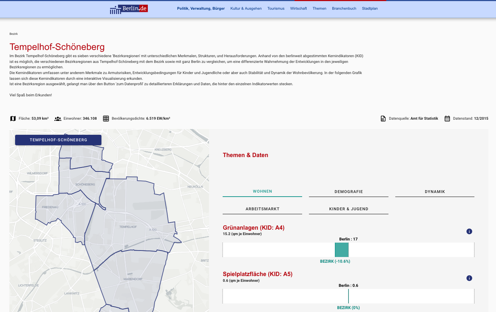
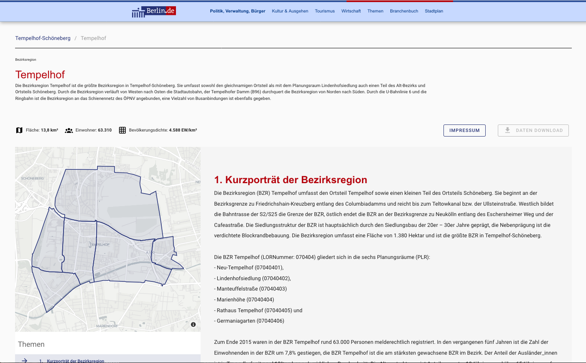

# bezirksregionenprofile_2_0

All data is loaded from API. API data can be edited in the [bezirksregionenprofile-daten
](https://github.com/technologiestiftung/bezirksregionenprofile-daten) repo

## Setup
```npm install```

## Config
Urls ```BASE_URL``` and ```API_URL``` need to be set in ```package.json``` files

In development mode ```BASE_URL``` defaults to ```http://localhost:3000```

Eventually check for CORS settings of API server if request in build process fail.

## Development
```npm run dev```
or
```npm run dev --fix```
to auto fix prettier format problems

## Build
Adjust urls in packagejson

```npm run bild```

## Content page data structure

The application is constructed to have an overview page of all pages and a subpage for each 'Bezirk'. As the first prototype is only made for 'Tempelhof-Schöneberg', there is a 'hack' to make Tempelhof-Schöneberg the starting page and exclude the view of the overview of all 'Bezirke'. For this 'hack' the *pages* folder was adapted.
To go back to the view for all 'Bezirke' put the content of the *pages_full_site* in the *pages* folder.

The 'Bezirk' page:



The 'Bezirksregion' page:



From each 'Bezirk' detail page (*pages/_bz*) detail pages for each 'Bezirksregion' can be accessed (*pages/_bz/_bzr*). The 'Bezirksregion' detail page contains the content of the 'Bezirksregionenprofil'. It contains a long content space which can be filled with different content elements.

Available content elements: 
* title - healine element
* title-sm small title
* text - text block
* image - image with optional headline
* barchart - barchart with optional headline (*components/charts/chartBar.vue*)
* linechart - linechart with optional headline (*components/charts/chartLine.vue*)
* map-pr - heatmap for all Planungsräume within the current Bezirksregion(*components/maps/prMap.vue*)
* map-poi - map with markers for current Bezirksregion (*components/maps/bzrMap.vue*)

For more information on the data input see the [GitHub Repository bezirksregionenprofile-daten](https://github.com/technologiestiftung/bezirksregionenprofile-daten).